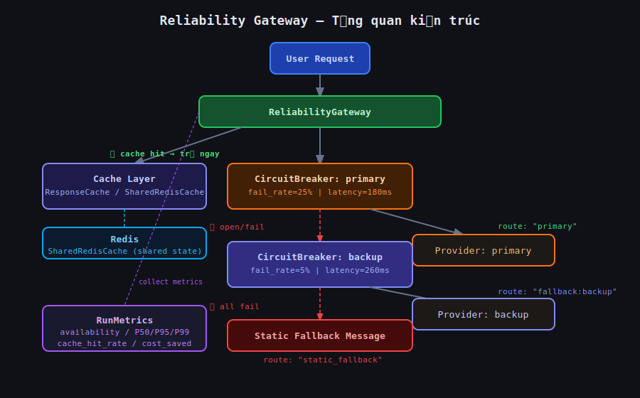
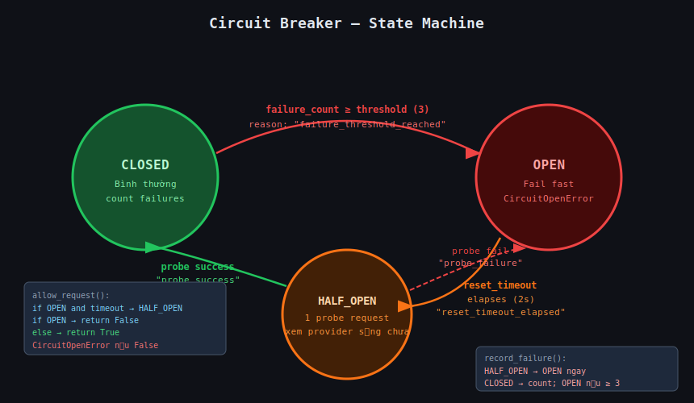
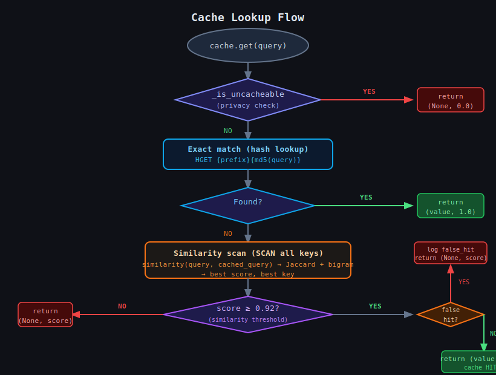
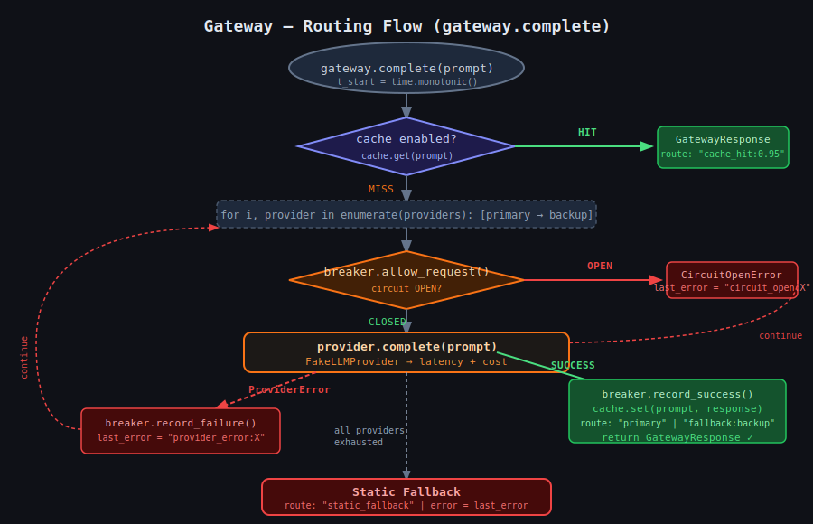
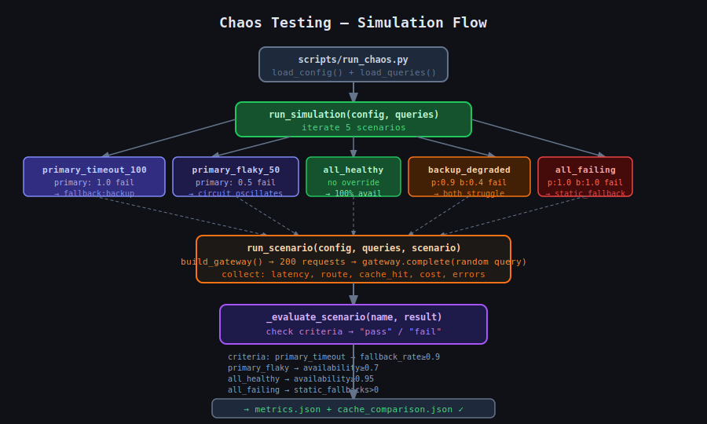

# Flow Diagrams — Reliability Agent Lab

**Họ tên:** Hồ Quang Hiển | **MSSV:** 2A202600059

Đây là 5 sơ đồ giải thích toàn bộ hoạt động của repo. Đọc theo thứ tự từ 01 → 05.

---

## 01 — Tổng quan kiến trúc



### Repo có gì?

```
src/reliability_lab/
├── providers.py       ← LLM giả (FakeLLMProvider)
├── circuit_breaker.py ← Cầu dao tự động (3 trạng thái)
├── gateway.py         ← Bộ định tuyến chính
├── cache.py           ← Bộ nhớ đệm (in-memory + Redis)
├── metrics.py         ← Thu thập số liệu
├── chaos.py           ← Chạy kịch bản lỗi
└── config.py          ← Load YAML config
```

### Luồng tổng quát

Mỗi request đi qua **4 checkpoint** theo thứ tự:

| Bước | Checkpoint | Nếu pass | Nếu fail |
|---:|---|---|---|
| 1 | Cache | Trả ngay (0ms, 0 cost) | Tiếp tục |
| 2 | CircuitBreaker primary | Gọi provider primary | Skip nếu OPEN |
| 3 | CircuitBreaker backup | Gọi provider backup | Skip nếu OPEN |
| 4 | Static fallback | — | Trả message cứng |

**Tại sao cần 4 lớp?** Provider thật ngoài đời hay bị chết. Nếu không có cầu dao, hệ thống sẽ retry liên tục → làm nặng thêm provider đang chết (retry storm). Cache giúp tiết kiệm cost và giảm latency cho câu hỏi lặp lại.

---

## 02 — Circuit Breaker (State Machine)



### 3 trạng thái

```
CLOSED ──(3 lần fail)──► OPEN ──(chờ 2s)──► HALF_OPEN
  ▲                                              │
  │◄──────────(probe thành công)─────────────────┘
  │
  OPEN ◄──(probe thất bại)── HALF_OPEN
```

| Trạng thái | Hành vi | Điều kiện chuyển |
|---|---|---|
| **CLOSED** | Request đi qua bình thường, đếm failure | `failure_count >= 3` → OPEN |
| **OPEN** | Fail nhanh (`CircuitOpenError`), không gọi provider | `reset_timeout (2s)` elapses → HALF_OPEN |
| **HALF_OPEN** | Cho 1 request probe thử | Thành công → CLOSED, Thất bại → OPEN lại |

### Tại sao quan trọng?

- **Không có circuit breaker:** App tiếp tục gọi provider chết → tốn latency chờ timeout → cascade failure
- **Có circuit breaker:** Sau 3 lần fail → dừng gọi ngay → fail fast → không làm nặng thêm

### Code chính (`circuit_breaker.py`)

```python
def record_failure(self):
    if self.state == HALF_OPEN:
        # Probe thất bại → mở ngay, reason rõ ràng
        self._transition(OPEN, "probe_failure")
    else:
        self.failure_count += 1
        if self.failure_count >= self.failure_threshold:
            self._transition(OPEN, "failure_threshold_reached")
```

---

## 03 — Cache Lookup Flow



### Cache hoạt động thế nào?

Cache lưu cặp `(query → response)`. Khi có query mới:

**Bước 1 — Privacy check:** Có từ khoá nhạy cảm không?
```python
# Không cache: "What is my account balance?" → chứa "balance"
PRIVACY_PATTERNS = re.compile(r"\b(balance|password|credit.card|ssn|...)\b")
```

**Bước 2 — Exact match:** Hash query → tìm trong Redis/memory
```python
key = f"rl:cache:{md5(query)[:12]}"
response = redis.hget(key, "response")  # O(1)
```

**Bước 3 — Similarity scan:** Không có exact match → quét tất cả entries
```python
# Jaccard unigram (70%) + bigram (30%)
similarity("refund policy?", "what is refund policy") → 0.75
```

**Bước 4 — False-hit check:** Score đủ cao nhưng số năm khác nhau?
```python
# "refund policy 2024" vs "refund policy 2026" → có số 4 chữ số khác → False hit!
_looks_like_false_hit("... 2024 ...", "... 2026 ...") → True → return None
```

### In-memory vs Redis

| | ResponseCache | SharedRedisCache |
|---|---|---|
| Lưu ở đâu | RAM của process | Redis server |
| Chia sẻ được không | Không (mỗi instance riêng) | Có (nhiều instance cùng đọc) |
| Sống qua restart | Không | Có (appendonly) |
| Latency hit | ~0.01ms | ~1–2ms |

---

## 04 — Gateway Routing Flow



### `gateway.complete(prompt)` làm gì?

```python
t_start = time.monotonic()

# 1. Cache check
cached, score = cache.get(prompt)
if cached: return GatewayResponse(route=f"cache_hit:{score:.2f}")

# 2. Fallback chain
for i, provider in enumerate(providers):   # primary → backup
    breaker = breakers[provider.name]
    try:
        response = breaker.call(provider.complete, prompt)
        cache.set(prompt, response.text)
        route = "primary" if i==0 else f"fallback:{provider.name}"
        return GatewayResponse(route=route, latency_ms=elapsed)
    except CircuitOpenError:
        last_error = f"circuit_open:{provider.name}"
    except ProviderError as e:
        last_error = f"provider_error:{provider.name}:{e}"

# 3. Tất cả fail
return GatewayResponse(route="static_fallback", error=last_error)
```

### Route reasons

| Route | Ý nghĩa |
|---|---|
| `"primary"` | Thành công qua provider chính |
| `"fallback:backup"` | Primary fail/open → backup xử lý |
| `"cache_hit:0.95"` | Trả từ cache, similarity score 0.95 |
| `"static_fallback"` | Tất cả fail, trả message cứng |

---

## 05 — Chaos Testing & Metrics



### Chaos testing là gì?

Chủ động tạo ra lỗi có kiểm soát để xem hệ thống phản ứng thế nào. Thay vì chờ lỗi thật, ta set `fail_rate=1.0` cho provider rồi đo.

### 5 kịch bản trong lab

| Scenario | Provider config | Kỳ vọng | Pass criterion |
|---|---|---|---|
| `primary_timeout_100` | primary: 100% fail | Backup xử lý hết | `fallback_success_rate >= 0.9` |
| `primary_flaky_50` | primary: 50% fail | Circuit mở/đóng | `availability >= 0.7` |
| `all_healthy` | không override | Hoàn hảo | `availability >= 0.95` |
| `backup_degraded` | p:90%, b:40% fail | Vẫn phục vụ được | `availability >= 0.5` |
| `all_failing` | cả hai 100% fail | Static fallback kích hoạt | `static_fallbacks > 0` |

### Metrics được thu thập

```
availability = successful / total
error_rate   = failed / total
cache_hit_rate = cache_hits / total
fallback_success_rate = fallback_successes / (fallback + static)
latency_P50/P95/P99  = percentile(latencies_ms, 50/95/99)
circuit_open_count   = số lần circuit mở (từ transition_log)
recovery_time_ms     = thời gian từ OPEN → CLOSED (từ transition_log timestamps)
estimated_cost_saved = cache_hits * avg_cost_per_request
```

### Pipeline hoàn chỉnh

```bash
make run-chaos    # → reports/metrics.json + reports/cache_comparison.json
make report       # → reports/final_report.md (9 sections)
```

---

## Cấu trúc file trong repo

```
src/reliability_lab/
├── config.py          ← Pydantic models load configs/default.yaml
├── providers.py       ← FakeLLMProvider: simulate latency/fail/cost
├── circuit_breaker.py ← CircuitBreaker: CLOSED/OPEN/HALF_OPEN state machine
├── cache.py           ← ResponseCache (in-memory) + SharedRedisCache (Redis)
├── gateway.py         ← ReliabilityGateway: orchestrate cache→CB→providers
├── metrics.py         ← RunMetrics: collect + compute + export JSON
└── chaos.py           ← run_scenario, run_simulation, run_cache_comparison

scripts/
├── run_chaos.py       ← CLI: config → simulate → metrics.json
└── generate_report.py ← CLI: metrics.json → final_report.md

configs/default.yaml   ← fail_rates, thresholds, scenarios, TTL

tests/
├── test_config.py              ← load YAML, check scenarios present
├── test_metrics.py             ← percentile calc, report dict keys
├── test_gateway_contract.py    ← gateway returns valid GatewayResponse
├── test_redis_cache.py         ← 6 Redis tests (shared state, TTL, privacy, false-hit)
└── test_todo_requirements.py   ← xfail: "2024" vs "2026" không được match

reports/
├── metrics.json           ← output của make run-chaos
├── cache_comparison.json  ← with/without cache comparison
└── final_report.md        ← báo cáo cuối 9 sections
```
